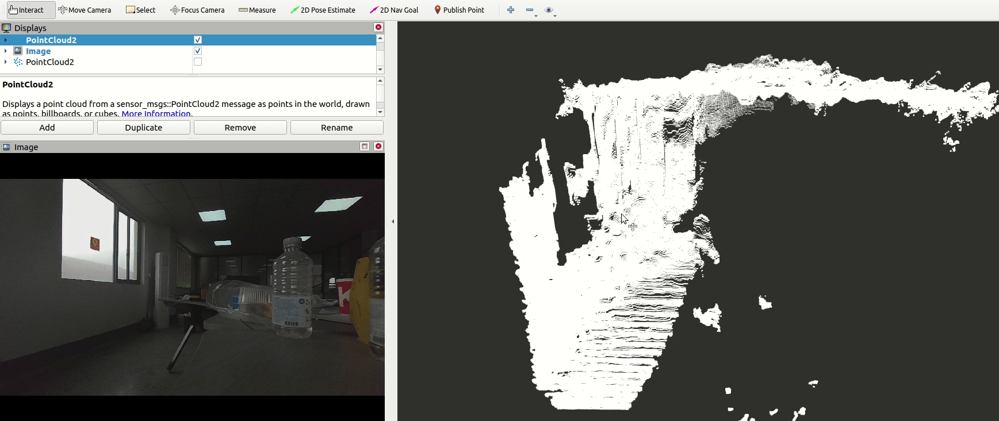
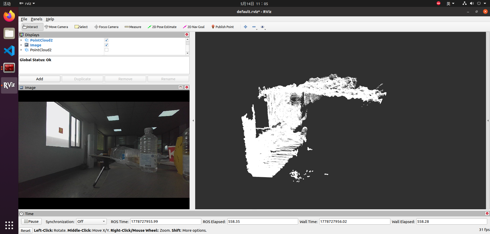
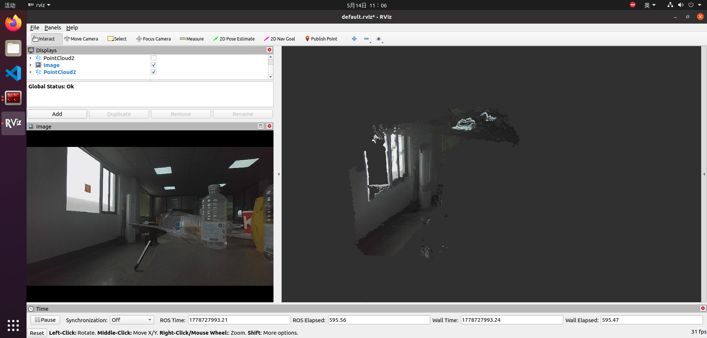
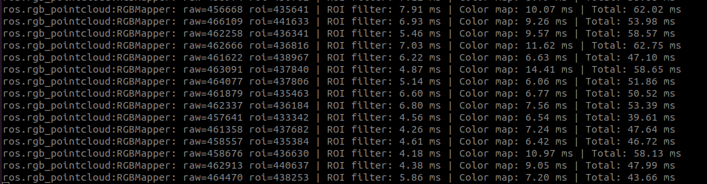

# 3D Point Cloud Colorization

Real-time point cloud colorization based on the ROS1 framework.

This project projects 3D point cloud data onto a camera image, obtains the corresponding RGB color from the image, and generates a colored point cloud. It is suitable for LiDAR-camera fusion, RGB-D camera visualization, robotics perception, and 3D scene reconstruction preprocessing.

---

## Features

- Real-time point cloud colorization in ROS1
- Supports camera intrinsic parameters and distortion coefficients
- Supports camera projection matrix configuration
- Supports LiDAR-to-camera transformation matrix
- Supports point cloud ROI filtering
- Publishes colored `PointCloud2` messages
- Uses OpenCV for image undistortion and projection
- Uses PCL for point cloud processing
- Uses OpenMP to accelerate point-wise color mapping

---

## Project Structure

```text
3D-Point-Cloud-Colorization
├── README.md
├── LICENSE
├── docs
│   └── images
│       ├── fix.png
│       ├── time.png
│       └── raw.png
|       └── result.png
└── rgb_pointcloud
    ├── CMakeLists.txt
    ├── package.xml
    ├── config
    │   └── camera.yaml
    ├── launch
    │   └── rgb_mapper.launch
    └── src
        └── rgb_mapper_node.cpp
```

---

## Show_Result

<p align="center">
  
</p>

## Before

<p align="center">
  
</p>

## After

<p align="center">
  
</p>

## Time

<p align="center">
  
</p>

